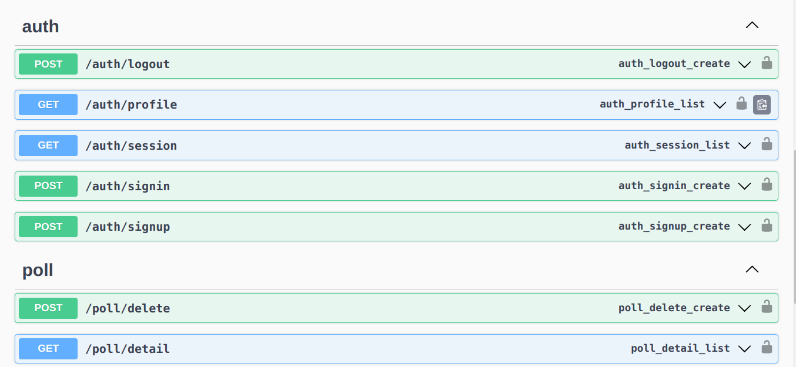
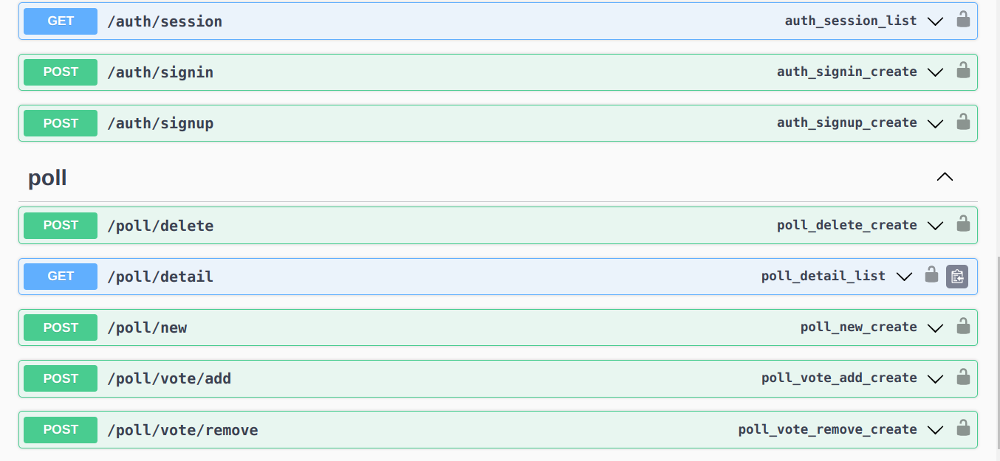
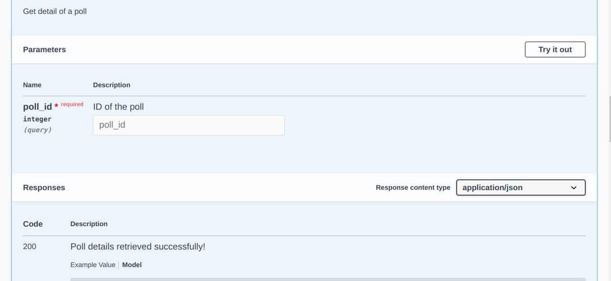
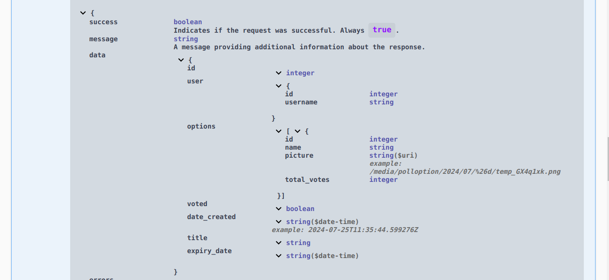
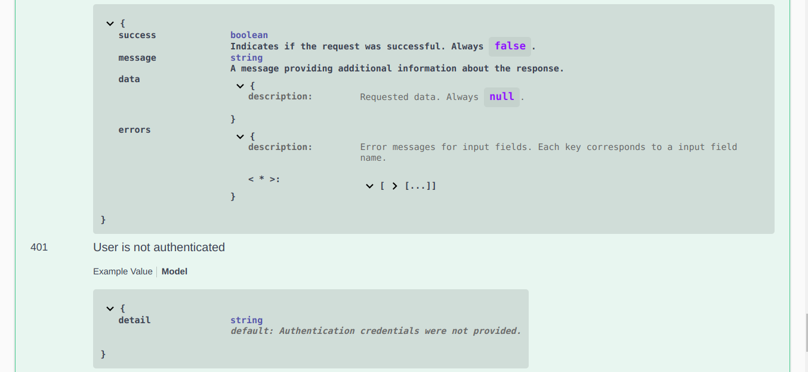
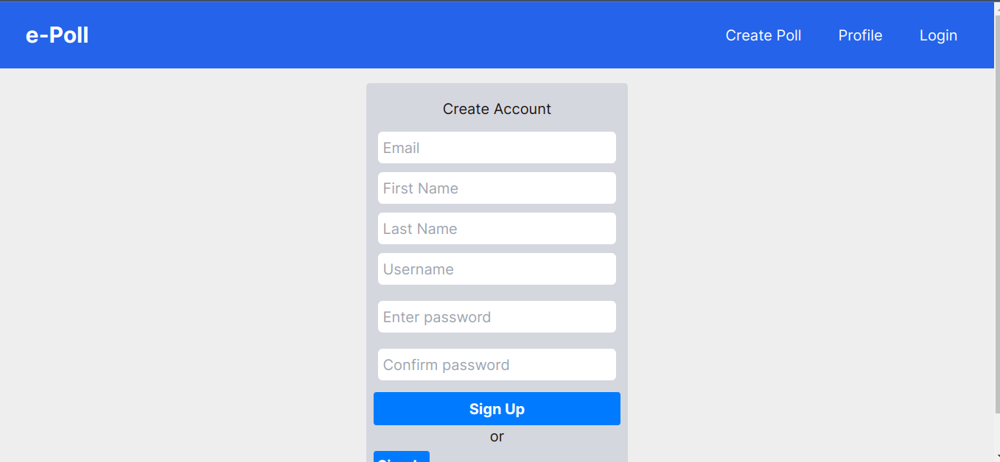
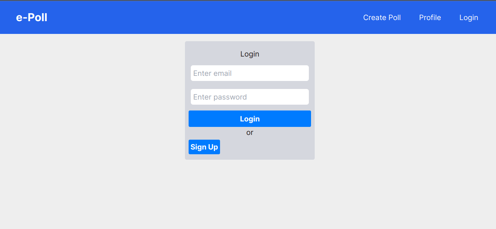
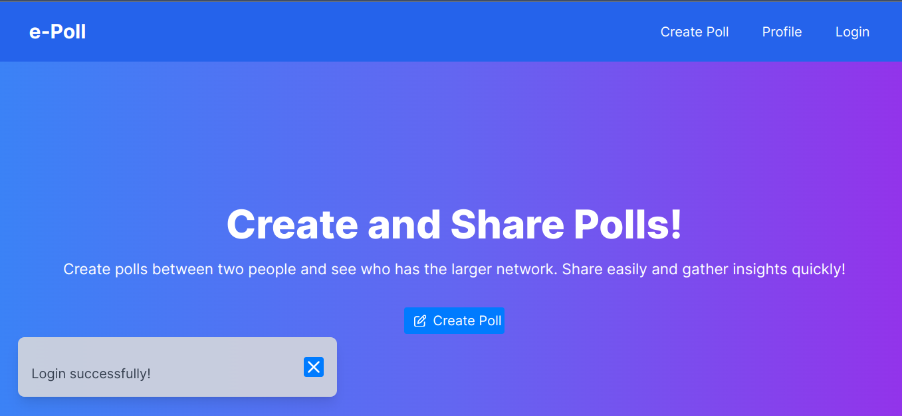
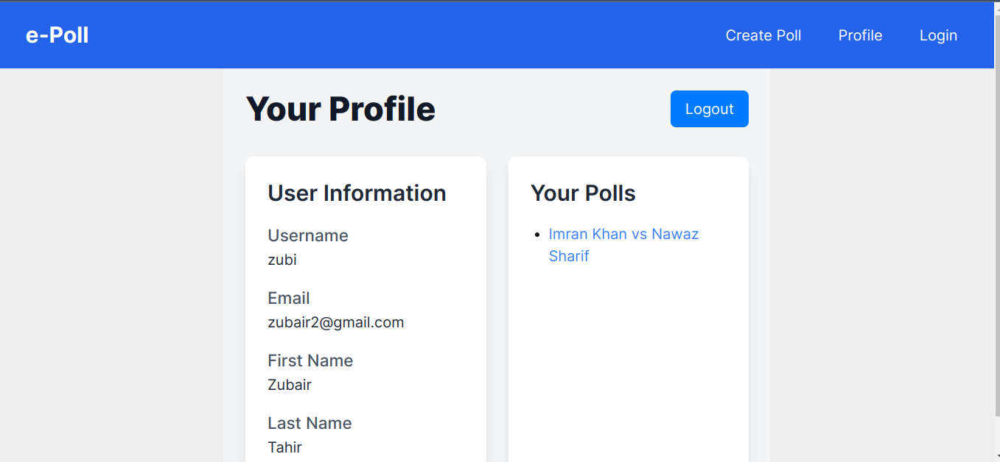
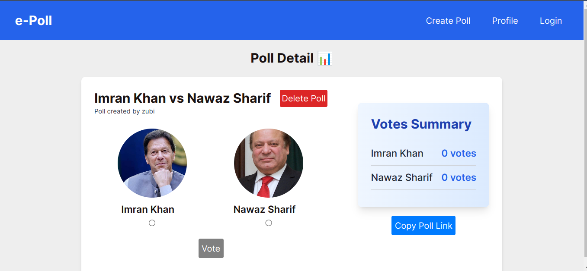

# Polling System

## Introduction

Welcome to the Polling System! 

This is a learning project—a web application that enables users to create polls between two individuals to determine who has a larger network and garners more votes. Users can share these polls, and people can vote on them without needing to log in, with each IP address allowed to vote once.

## Repository Structure

- **`polling-system`**: Contains the frontend code for the project.
- **`pollingsystem`**: Contains the backend code and API logic.
- **`readme_images`**: Stores images used in the README files.

## Features

- **Create Polls**: Users can create polls comparing two individuals.
- **Share Polls**: Polls can be shared.
- **Vote**: Anyone with the link can vote on the poll without logging in. Only one vote per IP address is allowed.
- **View Results**: View results to see who has more votes.

## Technologies Used

- **Backend**: `Django` `Django Rest Framework (DRF)` `Swagger/OpenAPI`
- **Frontend**: `Next.js` `Tailwind CSS`

## Screenshots

### APIs Documentation

### Frontend

